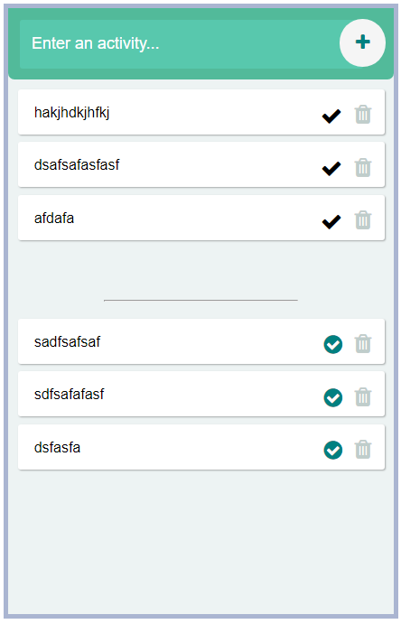
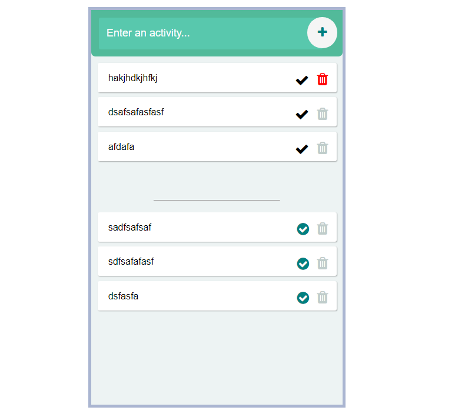

# Todo-dom-musfir
 This is basic Todo-App which have basic functionalities.
 we add our task by click add button.

we remove our task on press delete button

Also make this responsive by using media query.

Font library I use in this "Font Awesome".

netlify Link: "https://pedantic-feynman-7e5db5.netlify.app/"
