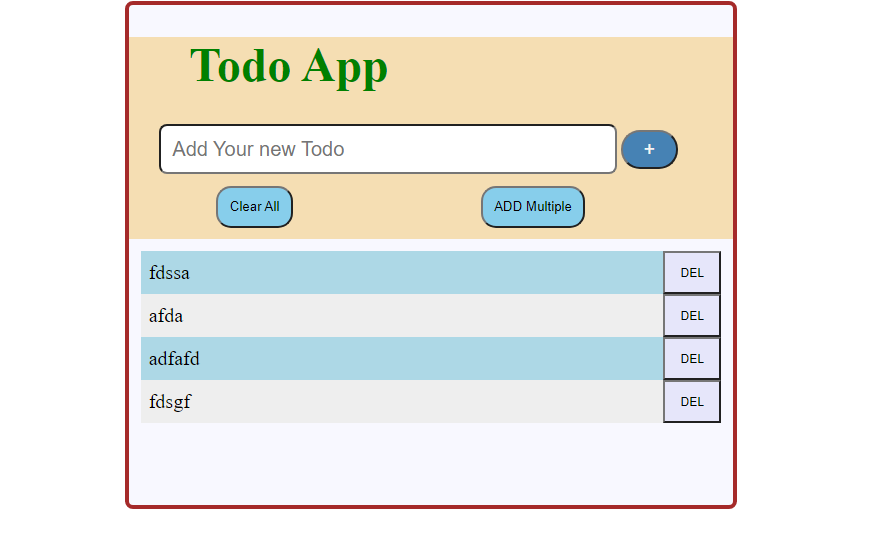
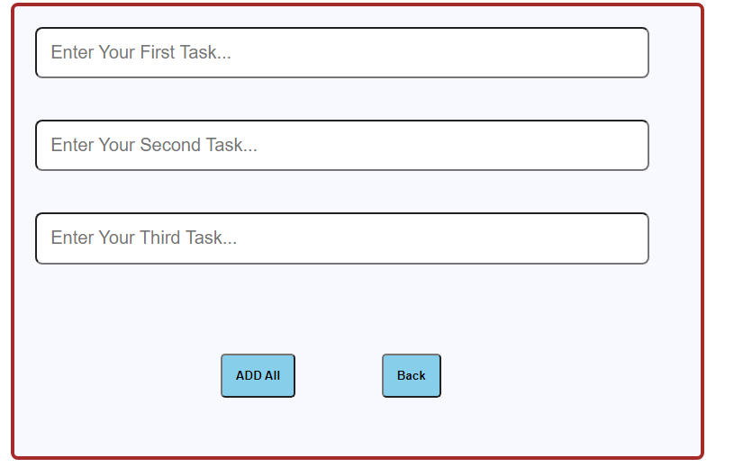

# Todo DOM-Html
This is basic todo app
 This is basic Todo-App which have basic functionalities.
 we add our task by click add button.

we remove our task on press delete button

We Add multiple task and clear list of task.

Font library I use in this "Font Awesome".

<h2>Netlify link: "https://epic-kare-c8f983.netlify.app/"</h2>
